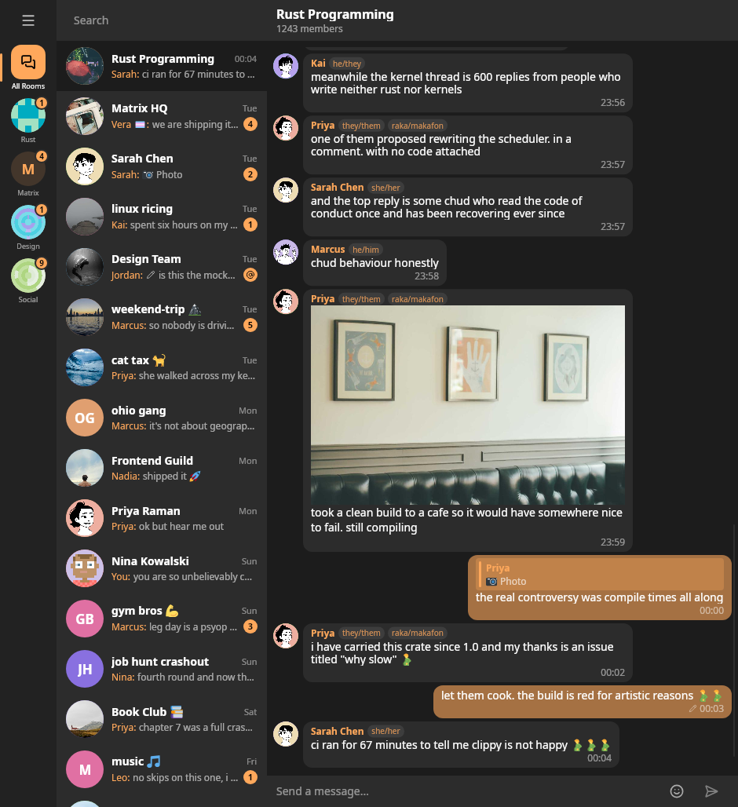

# U2DM

Unable to Decrypt Message: a Matrix chat client built with Slint UI.



## Status

Early development. Expect incomplete features, rough edges, and breaking changes.

## Features

- Password and OAuth login
- Room list with message previews and unread and mention badges
- Spaces shown as a reorderable rail that filters the room list
- Message timeline
- Pronoun badges next to sender names (MSC4247 profile field)
- Emoji picker
- Media showing and download
- SAS device verification for encrypted rooms
- Encrypted session storage using SQLite and the OS keyring

## Building

```sh
cargo run
```

The first build downloads the bundled color emoji font from the [`u2dm/twemoji`](https://github.com/u2dm/twemoji) release. It is cached at `ui/fonts/Twemoji.ttf` afterwards.

## Feature flags

Both are off by default, so a plain `cargo run` gives you the compiled UI talking to a real homeserver.

- `interpreted` load the `.slint` files at runtime instead of compiling them into the binary. Edit the UI and relaunch without a rebuild, at the cost of a slower start.

  ```sh
  cargo run --features interpreted
  ```

- `demo` run against fake rooms, spaces and timelines instead of a real account, useful for screenshots and UI work. The data lives in `assets/demo/data.json` and is read at runtime. Avatars and thumbnails are fetched on first build and fall back to initials if unavailable.

  ```sh
  cargo run --features demo
  ```

## Licenses

- Code: **AGPL-3.0-or-later**.
- Bundled third-party assets (the Twemoji emoji font): see
  [`THIRD-PARTY-LICENSES.md`](THIRD-PARTY-LICENSES.md).
