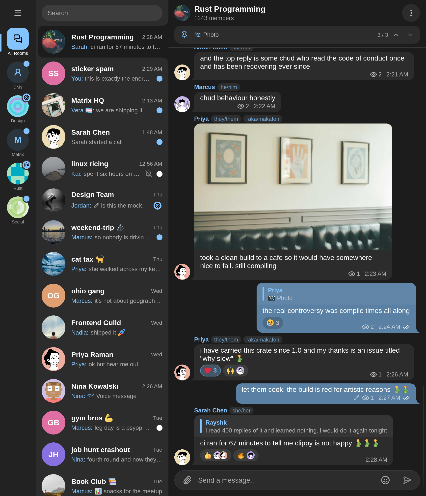

<div align="center">

<picture>
  <source media="(prefers-color-scheme: dark)" srcset="https://u2dm.github.io/logo/logo-dark.svg">
  
</picture>

# u2dm

Unable to Decrypt Message: a Matrix client built with Rust and Slint.

</div>



Early development.

## Features

- Password and OAuth login
- End-to-end encryption, device verification
- Reactions, polls, stickers
- Video and audio playback
- Pronouns ([MSC4247](https://github.com/matrix-org/matrix-spec-proposals/pull/4247))
- Touch gestures

## Planned

- More gestures
- Calls
- Multiple accounts
- User, room and space management
- More responsive layouts
- Android support
- Theming

## Building

```sh
cargo run
cargo run --features demo                                     # fake data, no account
cargo run --no-default-features --features interpreted,video  # if you want to edit the UI without rebuilding
```

The first build downloads the emoji font from [u2dm/twemoji](https://github.com/u2dm/twemoji). Run `just` for shortcuts.

## License

AGPL-3.0-or-later. Third-party assets: [THIRD-PARTY-LICENSES.md](THIRD-PARTY-LICENSES.md).
